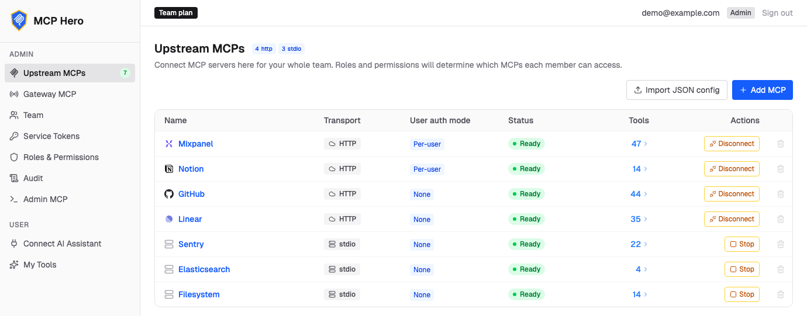
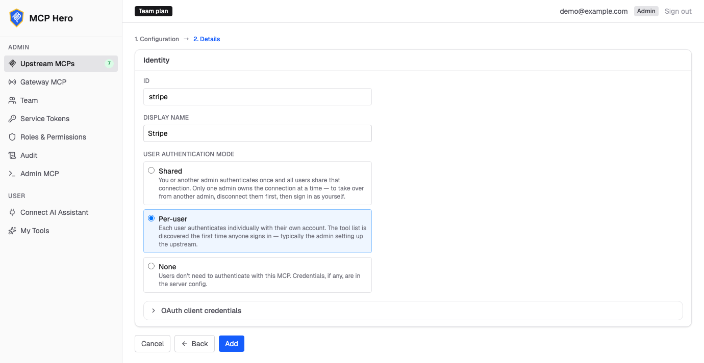
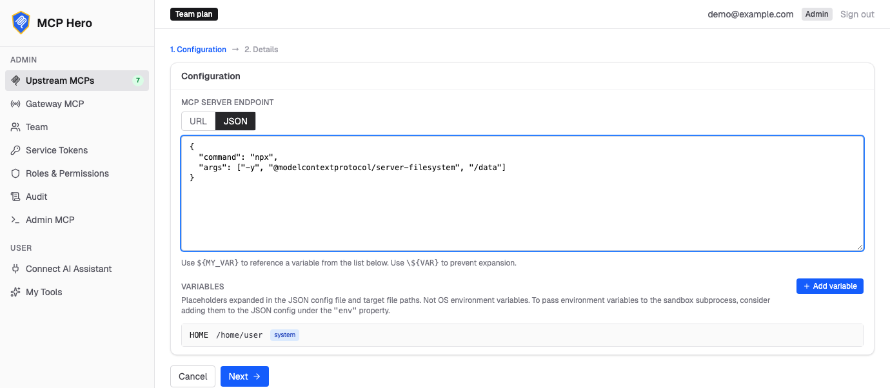

```
███╗   ███╗ ██████╗██████╗     ██╗  ██╗███████╗██████╗  ██████╗
████╗ ████║██╔════╝██╔══██╗    ██║  ██║██╔════╝██╔══██╗██╔═══██╗
██╔████╔██║██║     ██████╔╝    ███████║█████╗  ██████╔╝██║   ██║
██║╚██╔╝██║██║     ██╔═══╝     ██╔══██║██╔══╝  ██╔══██╗██║   ██║
██║ ╚═╝ ██║╚██████╗██║         ██║  ██║███████╗██║  ██║╚██████╔╝
╚═╝     ╚═╝ ╚═════╝╚═╝         ╚═╝  ╚═╝╚══════╝╚═╝  ╚═╝ ╚═════╝
```

# MCP Hero

**One endpoint for all your MCP servers, with the access control, auth, and auditing a team needs.**

Hosted version: **[mcphero.io](https://mcphero.io)** · or self-host with this repo.

<p align="center">
  <a href="https://mcphero.io"></a>
</p>

---

## What is MCP Hero?

MCP Hero is a self-hostable **gateway for [Model Context Protocol](https://modelcontextprotocol.io) servers**. It mounts many upstream MCP servers behind a single URL and adds the things you need to run them for real:

- **One endpoint** — point your MCP client (Claude and friends) at one gateway URL instead of wiring up each server separately.
- **Role-based access control** — decide which roles can reach which servers, down to individual tools.
- **Per-user OAuth to upstreams** — each user authenticates to upstream servers as themselves; tokens are stored encrypted.
- **Hosted stdio MCPs** — run `command:`-style stdio MCP servers in isolated sandboxes, not just remote HTTP ones.
- **Audit logging** — every tool call is recorded.
- **Service tokens for agents** — headless clients (CI jobs, bots, server-side AI agents) connect with a revocable bearer token bound to a least-privilege role, no browser sign-in needed.
- **A web dashboard** — manage servers, roles, and users without touching config files.

You can run it two ways, controlled by a couple of environment variables (see [below](#the-three-switches-that-decide-how-it-runs)): a zero-config **standalone** mode for a single person or team, or a multi-tenant **cloud** mode (what powers mcphero.io).

---

## Quick start (standalone)

The fastest way to try it. **No Python or Node toolchain required** — just Docker.

```bash
git clone https://github.com/nseniak/mcphero.git
cd mcphero
docker compose --profile standalone up --build
```

Then open **http://localhost:8080**. On first launch you'll see an email picker (standalone uses a no-login dev auth by default); pick any email and you become the admin of the default org. Config and data persist in Docker volumes (`mcpolis-config`, `mcpolis-data`), so your setup survives restarts.

That's the whole install. Now add your first MCP server.

### Adding your first MCP

Open **Upstream MCPs → Add MCP** in the dashboard. There are two kinds of server you can mount:

**Remote HTTP MCP** — a server you reach over a URL (GitHub, Notion, Linear, …). Paste its URL, then choose how users authenticate: **Per-user** (each person signs in with their own account via OAuth), **Shared** (one admin connection the whole team uses), or **None** (no auth, or credentials baked into the config).

<p align="center">
  
</p>

**Hosted stdio MCP** — a `command:`-style server (e.g. `npx …`) that MCP Hero runs for you — by default as a local subprocess, or in an isolated remote sandbox when you configure one. Switch to the **JSON** tab and paste its config (command, args, env). Secrets are stored safely whether you write them inline or pull them into reusable `${VARIABLE}` placeholders — config lives in local files in standalone mode and is encrypted in the database in cloud.

<p align="center">
  
</p>

Hit **Add**, then **Start** to connect — the server's tools light up in the list and become reachable through your single gateway URL.

> Standalone defaults to a **no-real-auth** email picker, which is perfect on your own machine. If you expose the dashboard to a network, turn on real Google sign-in — see below.

### Turn on Google sign-in

The default email picker (`dev_stub`) has no real login. To require Google sign-in instead:

1. **Create a Google OAuth client.** In the [Google Cloud Console](https://console.cloud.google.com/apis/credentials) → *Credentials*, create an **OAuth client ID** (Web application). Add your dashboard URL as an *Authorized JavaScript origin*, and set the *Authorized redirect URI* to `<your-url>/mcp/oauth/google/callback` (for local use that's `http://localhost:8080/mcp/oauth/google/callback`).

2. **Set these env vars** (and point `MCPOLIS_SERVER_URL` at the same URL whose callback you registered):

   ```bash
   MCPOLIS_OAUTH_PROVIDER=google
   MCPOLIS_GOOGLE_CLIENT_ID=<client id>
   MCPOLIS_GOOGLE_CLIENT_SECRET=<client secret>
   MCPOLIS_SERVER_URL=http://localhost:8080   # the URL whose redirect URI you registered
   ```

   Where they go depends on how you run:
   - **From source:** `backend/.env`.
   - **Cloud:** `.env.cloud.docker.prod` (cloud already requires `google`).
   - **Docker standalone:** add them under an `environment:` block on the `standalone` service in `docker-compose.yml` (that image takes no runtime env file).

3. **Restart.** Logins now go through Google, and the returned email is matched to roles.

The detailed walkthrough (and per-upstream OAuth) is in the [backend README](backend/README.md#google-oauth-setup).

---

## Connecting clients: humans and agents

Two kinds of client connect to the gateway, and each has a first-class credential:

### Human users — interactive Google sign-in

A team member points their AI client (Claude, ChatGPT, Cursor, …) at the gateway URL shown on the dashboard's **Gateway MCP** page. The client walks through Google OAuth in the browser; the signed-in email is matched to the member's role, and the tools that role allows light up in their client. Tokens are short-lived and refresh silently.

### Headless agents — service tokens

Software has no browser: a CI job, a scheduled script, or an AI agent in a container can't complete an interactive sign-in. For those, an admin mints a **service token** on the dashboard's **Service Tokens** page: a revocable bearer credential bound to one organization and one role. The agent sends it as a header — no sign-in flow at all:

```json
{
  "mcpServers": {
    "mcphero": {
      "url": "http://localhost:8080/mcp",
      "headers": { "Authorization": "Bearer svct_..." }
    }
  }
}
```

The token's access is exactly the role you chose (make a least-privilege role for it), it never expires until revoked, and every call it makes is audited under its own `svc:<name>` identity. Full guide: [Service tokens](docs/service-tokens.md).

---

## The three switches that decide how it runs

Almost all behavior comes down to three environment variables:

| Variable | Values | What it controls |
|---|---|---|
| `MCPOLIS_MODE` | **`standalone`** (default) · `cloud` | **Storage + tenancy.** `standalone` = a single org, file-backed storage, no external services. `cloud` = multi-org SaaS, MongoDB + Redis, encrypted tokens, horizontally scalable. |
| `MCPOLIS_OAUTH_PROVIDER` | **`dev_stub`** (default) · `google` | **Dashboard auth.** `dev_stub` = pick-an-email with no real login (ideal for local/standalone). `google` = real Google OAuth. Cloud mode forces `google` and rejects `dev_stub` at startup. |
| `MCPOLIS_SANDBOX_PROVIDER` | **empty = auto** (default) · `e2b` · `local-subprocess` | **How stdio MCP servers execute.** Auto-selects `e2b` (isolated remote sandbox) when `MCPOLIS_E2B_API_KEY` is set, otherwise `local-subprocess` (spawned on the host, no isolation — dev only). Cloud mode requires `e2b`. |

The first two combine into the setups you'd actually want:

- **`standalone` + `dev_stub`** — zero-config local run. This is the Quick start above.
- **`standalone` + `google`** — a hardened single-tenant deployment you can expose safely.
- **`cloud` + `google`** — the multi-tenant SaaS (what mcphero.io runs).

`MCPOLIS_SANDBOX_PROVIDER` is mostly automatic: drop in an `MCPOLIS_E2B_API_KEY` and stdio servers run isolated in a remote sandbox; leave it unset and they run as local subprocesses (fine on your own machine, flagged as unsafe at startup). Whether stdio MCPs are allowed at all is a separate gate — `MCPOLIS_ALLOW_STDIO_MCP` (on by default in standalone, off in cloud).

Set these in `backend/.env` (from-source) or your Docker env file. The defaults already give you the standalone experience, so you only touch them when you want real auth, cloud mode, or remote sandboxing.

---

## Develop from source

For working on MCP Hero itself (hot-reloading dashboard, tests, etc.).

### Prerequisites

- **Python 3.12** in an environment of your choice (venv, conda, uv, ...). The dependency manager is [Poetry](https://python-poetry.org).
- **Node.js 20+**
- **Docker** (only for cloud mode, or to run tests against Mongo)

### Setup

```bash
# Activate your Python 3.12 environment first, then:
cd backend && poetry install && cd ..
cd frontend && npm install && cd ..
```

The shell scripts assume your project Python environment is already active. (They source an optional, gitignored `run-in-env.local.sh` if you want them to activate it for you — handy if you use conda or pyenv. See [`run-in-env.sh`](run-in-env.sh).)

### Run

```bash
bash start.sh standalone   # standalone, file-backed, no containers
bash start.sh cloud        # cloud: starts Docker (Mongo + Redis), multi-org
bash start.sh              # defaults to cloud
```

From source, the dashboard runs on the Vite dev server:

- Dashboard: **http://localhost:5173**
- Gateway/API backend: **http://localhost:8080** (logs at `/tmp/mcpolis-backend.log`)

`bash stop.sh` tears it down (`--all` also stops the Mongo + Redis containers).

### Tests and linting

```bash
bash backend/run-unit-tests.sh            # backend unit tests (pytest)
bash frontend/run-unit-tests.sh           # frontend unit tests (vitest)
bash tests/run-e2e-tests.sh               # full-stack E2E (Playwright)
bash backend/run-pyright.sh src/ tests/   # type check
cd backend && poetry run ruff check .     # lint
```

Integration tests that hit the live E2B API are gated by an API key — see [`backend/tests/integration/.env.test.example`](backend/tests/integration/.env.test.example).

---

## Running in cloud mode (multi-org, scalable)

Cloud mode is the multi-tenant SaaS shape: MongoDB-backed, Redis-coordinated, horizontally scalable behind nginx, with encrypted OAuth tokens and real Google auth.

1. Create the secrets file from the template and fill it in:

   ```bash
   cp .env.cloud.docker.example .env.cloud.docker.prod
   ```

   ```bash
   MCPOLIS_SESSION_SECRET=<random-string>
   MCPOLIS_ENCRYPTION_KEY=<random-string>
   MCPOLIS_SERVER_URL=https://your-domain.com
   MCPOLIS_OAUTH_PROVIDER=google           # cloud requires real OAuth
   MCPOLIS_GOOGLE_CLIENT_ID=<your-client-id>
   MCPOLIS_GOOGLE_CLIENT_SECRET=<your-client-secret>
   ```

2. Build and start:

   ```bash
   docker compose --profile cloud up --build                  # single backend
   docker compose --profile cloud up --build --scale backend=2 # horizontal scaling
   ```

   This starts nginx (port 80) + backend(s) + MongoDB + Redis.

### Behind an external reverse proxy

When co-tenanting MCP Hero behind another proxy (Caddy, Traefik, an ALB, K8s ingress), use the `docker-compose.proxied.yml` overlay, which drops nginx's host port binding and joins a shared external Docker network:

```bash
docker network create web
docker compose -f docker-compose.yml -f docker-compose.proxied.yml --profile cloud up -d --build
```

### Cloud architecture

```
                  ┌─────────┐
   :80 ──────────>│  nginx  │
                  └────┬────┘
                       │  sticky sessions (mcp-session-id header)
              ┌────────┼────────┐
              v        v        v
         ┌────────┐┌────────┐┌────────┐
         │backend1││backend2││backend3│
         └───┬────┘└───┬────┘└───┬────┘
             │         │         │
        ┌────┴─────────┴─────────┴────┐
        │   MongoDB        Redis      │
        └─────────────────────────────┘
```

- **nginx** serves the dashboard SPA and reverse-proxies API/MCP traffic with sticky routing on the `mcp-session-id` header.
- **Backends** are stateless except for in-memory upstream connections; a Mongo-backed distributed lock coordinates token refresh, and SIGTERM drains gracefully.
- **MongoDB** stores org config, upstream definitions, OAuth tokens (AES-256-GCM encrypted), and audit logs.
- **Redis** provides cross-backend pub/sub and rate limiting.

### Health checks

- `/health` — always `{"status": "ok"}`.
- `/healthz` — `{"status": "ok"}` normally, `{"status": "draining"}` (503) during graceful shutdown. Use this for load-balancer checks.

---

## Standalone vs cloud: what actually differs

Most domain logic is shared; divergence is concentrated in the storage factory, the startup-secret validator, and a handful of org-context branches, all selected at boot via `MCPOLIS_MODE`.

| Concern | Standalone | Cloud |
|---|---|---|
| Persistence | JSON files in `backend/config/` + `backend/data/` | MongoDB |
| Org model | Single `default` org auto-created at boot | Multi-org; users create orgs at signup |
| First-user bootstrap | First login becomes admin of `default` | Orgs created via signup flow |
| Dashboard auth default | `dev_stub` (in-app email picker) | `google` (required) |
| Field encryption | None (plaintext on disk) | AES-256-GCM on OAuth tokens via `MCPOLIS_ENCRYPTION_KEY` |
| Rate limiter | In-process counter | Redis sliding window |
| Event stream / dashboard SSE | In-process pub/sub | Redis channels, per-org isolation |
| Distributed lock | No-op | Mongo TTL collection |
| Sandbox refs (E2B reattach) | In-memory (lost on restart) | Mongo-backed (survives restart) |
| `stdio` MCP default | Allowed | Disabled (override via `MCPOLIS_ALLOW_STDIO_MCP`) |
| Sandbox provider | `e2b` or `local-subprocess` | `e2b` only |
| Startup secret validation | Skipped | Enforces session/encryption/Mongo/Redis (+ E2B when used) |
| Multi-org UI (`OrgSwitcher`, Team page) | Hidden | Shown |

---

## Repo layout

- `backend/` — Python (Poetry) MCP gateway service
- `frontend/` — React + Vite + Tailwind admin dashboard
- `docker/` — Dockerfiles, nginx config, entrypoint script
- `docs/` — user-facing documentation

---

## Securing secrets

In **standalone** mode, `backend/config/` and `backend/data/` hold sensitive material (API keys, OAuth tokens, client secrets). For production, consider encrypting at rest:

- **macOS:** encrypted disk image (`hdiutil create -encryption AES-256`)
- **Linux:** gocryptfs or LUKS
- **Cross-platform:** [VeraCrypt](https://veracrypt.fr)

In **cloud** mode, secrets live in `.env.cloud.docker.prod` (gitignored) and tokens are encrypted in MongoDB via `MCPOLIS_ENCRYPTION_KEY`.

> **Warning:** rotating `MCPOLIS_ENCRYPTION_KEY` invalidates all stored OAuth tokens — users will need to re-authenticate their upstream connections.

---

## Security

Found a vulnerability? Please report it privately — see [SECURITY.md](SECURITY.md). Don't open a public issue for security problems.

---

## License

MCP Hero is licensed under the **GNU Affero General Public License v3.0 or later** (`AGPL-3.0-or-later`). See [LICENSE](LICENSE) for the full text.

The AGPL's network-use clause (section 13) means that if you run a modified version of MCP Hero as a network service, you must make the corresponding source available to its users. If the AGPL doesn't fit your use case, a commercial license is available — reach out via the contact page at [mcphero.io](https://mcphero.io).

## Trademarks

"MCP Hero", the MCP Hero name, and the MCP Hero logos are trademarks of Nitsan Seniak. The AGPL covers the **source code** only; it does **not** grant any right to use the MCP Hero name or logos.

You may run, modify, and redistribute the code under the AGPL. The brand assets (`hero-*` logos, favicon, OG images) are bundled so the official build renders correctly — but if you operate your own or a modified instance, please replace them with your own branding and don't present it as the official MCP Hero service.
